# WingMan

## INDEX

* [Quick Start Guide](#quick-start-guide)
* [Installation](#installation)
* [Research](#research)
* [Testing](#testing)
* [How To Use](#usage)
* [Contact And Credits](#contact)
* [Fake Profiles](#fake-profiles)
* [Future Of This App](#to-do-list)

## Description

A dating app powered by A.I.

On this app you can sign up and match with other users around the world. The idea is that a machine learning algorithm will find the best possible matches for you so you don't have to sift through droves of bad results. If I had a more tools and more time I could see this becoming something very interesting.

---

## Visuals

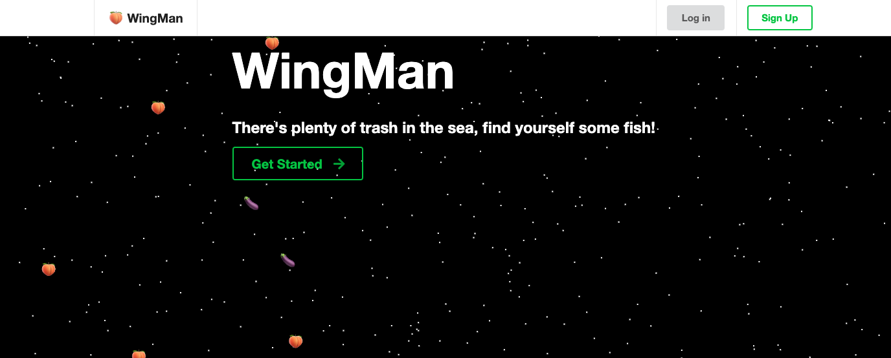

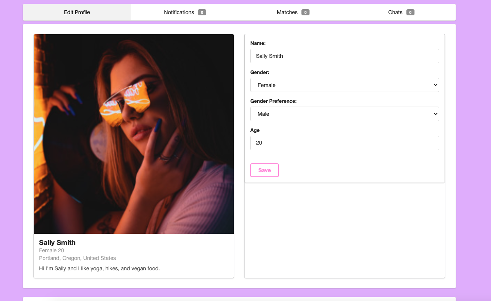

---

## Research

### PRIMARY RESEARCH COMPONENT: Machine Learning with TensorFlow.js:

> As the primary area of research for the second half of this year I chose Machine Learning with TensorFlow.js.
>
> I have great personal interest in the field, and I have devoted significant time and energy to mastering these concepts.
>
> I still have a long way to go.
>
> That is the reason I chose this.
>
> So many things in our world are well explored and old, there may not be much room for new innovation and discovery. That's sad. I think of myself as a bit of an explorer, not of the oceans and lands of the earth, but of the mind. Exploring the world of information to find the next thing that will transform lives in a way never before thought possible. Machine Learning is a field where there is still a lot of room for exploration and discovery. I personally feel that given the time and freedom that even I might be able to create some interesting things in this field. When this field advances, humanity itself advances with it, in step. That's just really incredible and totally irresistible!
>
> As far as my implementation goes, I was not actually able to properly implement it, simply due to limited tools.
>
> I am aware that this model structure is not correct for this specific task. Unfortunately I do not have access to tfjs-node and therefore am unable to train a convolutional layer from scratch to output common image features relevant to the task of recognizing subjective attractiveness. The GPU memory space required is simply beyond the capacity of a browser tab, and even if it wasn't, the speed of training would be too slow. I am confident that if the convolution side of the model were trained on the server side and the neural net on the client, that this would be an effective system. Periodically the convolution layer could be retrained on the server with the ever-growing dataset to produce even better outcomes. In a way, when it's lifespan is over, the model would learn from it's children, die, and be reborn, then repeat.
>
> That being said I have still implemented a lot in the way of three machine learning components.
>
> 1. Human Detector
>
>    I created a nice little react component that acts as a file input. The user selects an image file on their device, and then a custom tool can be used to select a square portion of the image. A web worker encapsulates the machine learning code related to the component. When a user uploads or makes changes to the image, debounced calls go to the worker. In the worker, after initialization, image data is converted to tensor and analyzed to determine whether or not the image contains a person. Messages are sent back to the react component to visualize the results. If the image does not pass the test, a message is posted to the user and a red border shadow appears on the component, indicating failure. The actual machine learning model being used I already trained ahead of time. I took a version of the MobileNet V1 Classification Model and I shaved off the convolution layers only. Then I retrained a deeply connected neural net based on the output of the convolution layers and labeled data I created. Afterwards I combined the models into one. In the end the model is very accurate even after only being trained on a relative handful of images. This little component is very useful, efficient, and does not block the main thread. Preventing users from uploading junk images is integral to the functionality of the app.
> 2. Client Training
>
>    A significant part of the user experience of this application is devoted to training your machine learning model to be better at recognizing what you find attractive. Users are forced to train a number of images every time before finding another match. Thus every subsequent match should be a better result, in the realm of attractiveness. After the user classifies a number of images a special component is rendered in conjunction with a machine learning program encapsulated in a web worker. The training data is loaded, and sent to the worker, after initialization. The worker then creates a new transfer learning deeply connected neural net based on the output of the same shaved convolution layers from MobileNet V1 and the users labeled data. The problem here is that I didn't have tfjs-node and therefore could not train a special convolution layer to recognize features better suited to this task. This would be the future of this app once I have access to the proper tools. Regardless the model as it stands is trained on the client and stored on the server, and it does learn from the users choices, though may not perform as expected.
> 3. Client Inference
>
>    During inference the users trained model is sent to a machine learning worker coupled with the potential match data provided by the server. In this worker the users profile image is ran through all of the potential matches models, collecting an array of the results. Then the potential matches photos are ran through the users model, collecting another array of results. Then the two results are compared to provide the best possible combined match. The best match is sent back to the client. During inference, which may take some time depending on many factors, a visual graph on the client side is updated live to provide feedback and visualization to the user that the app is hunting for a match. I feel this is important so that the user has a level of trust that the app is really working for them.
>
> After all is said and done I am just desperate to get out there and start creating some good things using this knowledge. I just hope I get the chance, before it's too late and it's all been done already.

### Socket.IO:

> Socket IO is an abstraction of the Web Sockets API which provides a means for the server to communicate with clients in both directions. This is very useful in the context of this application as this app uses notifications and messages. This implementation provides real-time feedback and updates as changes occur, without reloads or refreshes.

> 1. When a user gets a match or notification while they are connected their U.I will update automatically to reflect.
> 2. When a user is in a chatroom and they post a message the other member of the room will instantly see the message.
> 3. When a user deletes a chatroom, other members will be kicked out so to speak.
> 4. When a user in a chatroom starts typing all other members will see a message showing that the user is typing.
> 5. These prevent phantom and inaccurate data and provide the standard chatroom feel.
> 6. In the future I might move further with this and only update needed data on clients, to further improve efficiency. Rather than trigger subsequent api calls to the server when something changes.

### Web Workers:

> I use web workers when I come across a problem that requires significant cpu resources and or may be long-running and U.I blocking. The web worker API allows me to create little mini-applications that will run on a thread separate from the U.I and greatly improve application performance, both actual efficiency as well as the U.X of avoiding blocking the U.I. Web workers are a bit tricky and require everything they need to be sent in via messages, they do not share the same context as regular javascript in the browser. They also do not have a lot of the same API's that come with the window object. That being said they are great and I use them quite a bit now.
>
> 1. I use workers to separate the machine learning code in this application.
> 2. These workers will fetch the tensorflow api.
> 3. They will convert data passed to them into gpu tensors.
> 4. They will operate, train, analyze and return messages with the results.
> 5. They will not block the U.I thread.
> 6. Unfortunately the GPU allocation is shared by the contexts and therefore it does not affect GPU performance.

### Advanced Dev-Tools Usage:

> Dev-Tools provides a lot of very useful features that I use a lot. Notably:
>
> 1. I use lighthouse to examine my application and find problems I may have missed.
> 2. I use the network panel to watch the requests and timing.
> 3. I use the throttling features to test for low-end devices or bad connections.
> 4. I use the performance panel to analyze the memory, cpu, and gpu being used to isolate bottlenecks and improve efficiency.
> 5. I use the breakpoints to step through pesky code and find out exactly what is going wrong.

### Authentication:

> Authentication is a no brainer for any website, especially one such as this. I implemented the form of authentication as provided by the node modules jsonwebtoken, dotenv, and bcrypt. I have implemented a variation of the LMS optional module version, with differences. Basically the server has access to a private key that the clients do not. When a user creates an account an algorithm is used to hash their password and the hash is stored in the database. Thus if the data is compromised the actual password is not. When a user signs in using the password, it is rehashed by the server using the same algorithm to determine if there is a match. If there is a match the server creates a jsonwebtoken of the users credentials signed using the secret key that will provide unchecked access to the site under that accounts authorization for up to six hours, when which it will expire and the process repeats.

> 1. Users may not send server request which modify other profiles private data.
> 2. Users may not request other profiles private data.
> 3. Users may only participate in application features when they have signed up, an in.
> 4. Other users data are managed by the server and not the clients.

### Complex Relational Mongooose:

> As I did not have time to get into SQL, I stuck with MongoDB for this project. I do however intend to transition to SQL in the future. As the nature and structure of the data in this application was often independent and or shared by profiles, a relational system was fitting.

> 1. A chatroom document is shared by the members of the chatroom, therefore it exists in its own collection and is referenced by its members.
> 2. The machine learning models, as they are very large and cumbersome, I chose to keep them separate, improve efficiency for the profile documents.
> 3. Profile deletion must systematically remove any and all references to that profile and its chats from the entire database.
> 4. Location data is stored in separate collection and indexed by text so the user can search for locations around the world.

### Robust Validation:

> I put a lot of work into the development of a smooth and painless user interface. Part of this interface is user error handling. I spent a lot of time creating descriptive errors and messages to the user that direct them to correct any mistakes, as well as recognizing the mistakes in both the client and server side code. Of course there will always be bugs that slip through the cracks, but I exterminated as many as I could find.

> 1. Form validation conditionals on the client.
> 2. Error messages to the client that the user can see.
> 3. Server side Mongoose schema validation.
> 4. Server side descriptive error generation.
> 5. Client will show server generated errors when appropriate.

---

## Technologies

 1. MongoDB
 2. Express
 3. React
 4. Node
 5. JavaScript
 6. CSS
 7. Semantic UI
 8. TensorFlow.js
 9. Socket.io
10. JWT
11. BCrypt
12. tfjs-vis
13. Many More...

---

## Installation

**If you do not yet have node/npm installed on your computer then stop here and follow the instructions available online to install node, npm is included with node.**

**These instructions are for a bash shell, you may have to use different commands if you are using a different interface.**

**Ensure that you have a MongoDB instance running in the background.**

### Quick Start Guide

Open a terminal or command line instance.

Navigate/cd to the **client** directory of this project.

Enter the following command to install dependencies. (This may take some time...)

```
$ npm i
```

Navigate/cd to the **server** directory of this project.

Enter the following command to install dependencies. (This may take some time...)

```
$ npm i
```

Enter the following command to restore the database.

```
$ npm run restore
```

Enter the following command to run the app in a production enviroment. (This may take some time...)

```
$ npm run production
```

Leave this terminal window open for the duration of use.

At this point you should see a URL in the terminal, feel free to navigate to this URL in your browser.

Or CMD-CLICK the link depending on your system.

---

### Advanced Development Guide

**WARNING**

```
THIS DEVELOPMENT MODE MAY CAUSE BENIGN ERRORS DUE TO create-react-app, PROXYING, AND SOCKET.IO REQUESTS

PLEASE DISREGARD THESE OCCURRENCES

IF YOU WISH TO USE THE APP PROPERLY USE THE INSTRUCTIONS ABOVE FOR PRODUCTION MODE
```

Open a terminal or command line instance.

Navigate/cd to the **server** directory of this project.

Enter the following command to install dependencies. (This may take some time...)

```
$ npm i
```

Enter the following command to restore the whole database from the backup.

```
$ npm run restore
```

Enter the following command to initialize and run the server in development.

```
$ npm run devstart
```

ADDITIONAL SERVER COMMANDS

---

If you wish to start from a clean slate you must still seed the database. Enter the following command to seed the database.

```
$ npm run seed
```

If you wish to backup the current state of the database. Enter the following command to seed the database.

**THIS WILL OVERWRITE ANY OLD BACKUP**

```
$ npm run dump
```

---

Open an additional terminal or command line instance.

Navigate/cd to the **client** directory of this project.

Enter the following command to install dependencies. (This may take some time...)

```
$ npm i
```

Enter the following command to run the development react enviroment. (If prompted for input press Y)

```
$ npm start
```

At this point you should have a browser window automatically opened that will update using HMR as you develop the app.

Leave all terminal windows open.

---

## Usage

Start at the home page:


If you want to check out the pre-made accounts, see the list at the bottom of this README and use their credentials to log in:

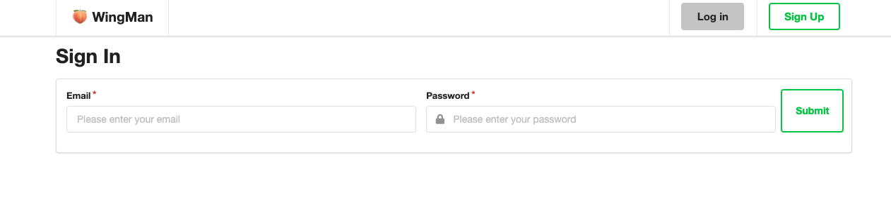

OTHERWISE

Go ahead and click get started or sign up to make an account:

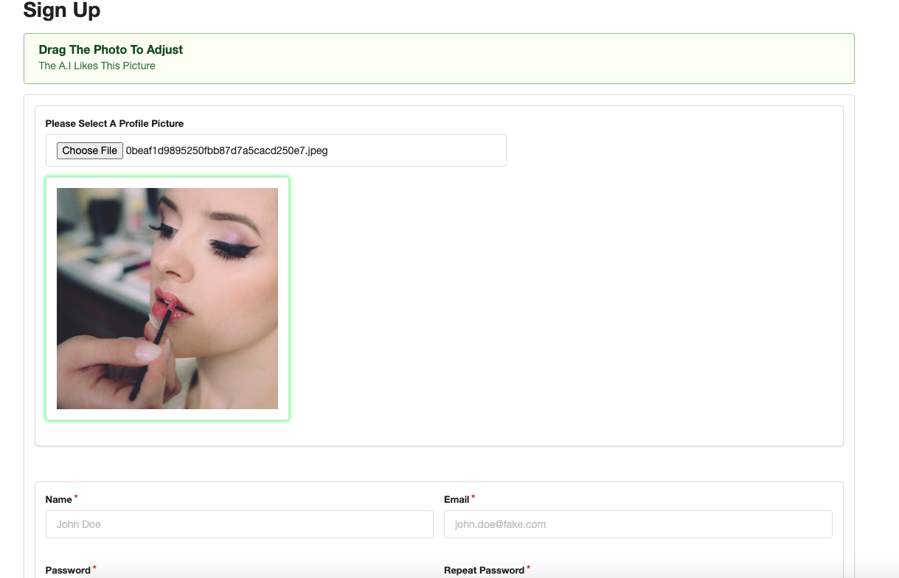

Complete the form:

Once you submit the form you will be sent to your account page:


Here you can edit your account information and see/save the results:

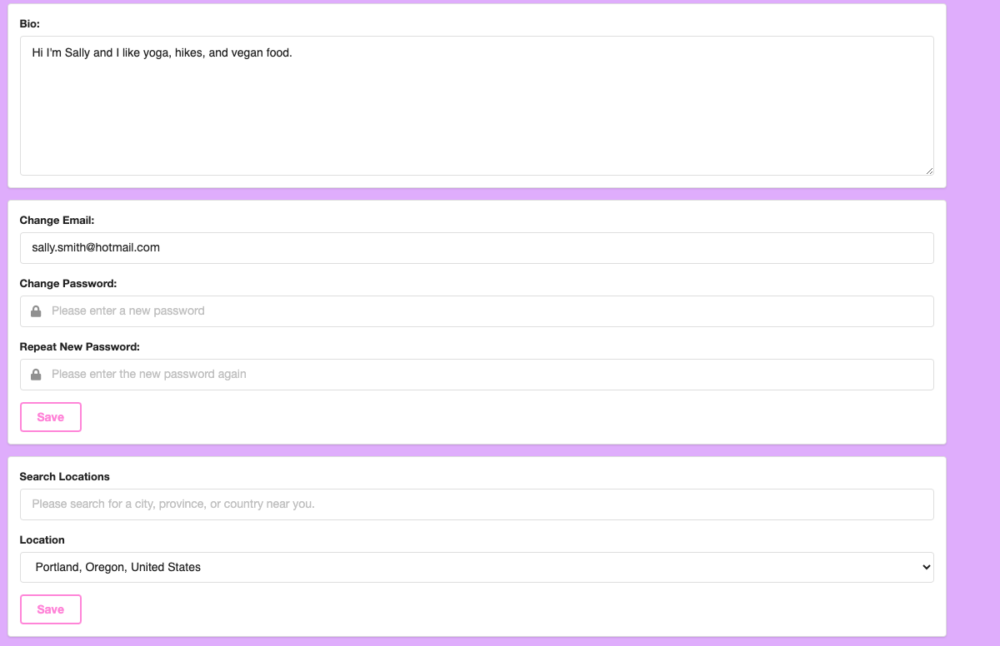

Change/save your theme and see the changes:

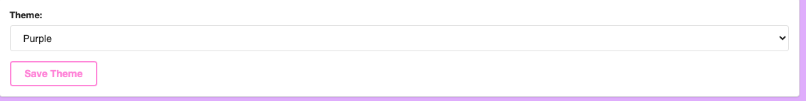

Search Locations Around The World:

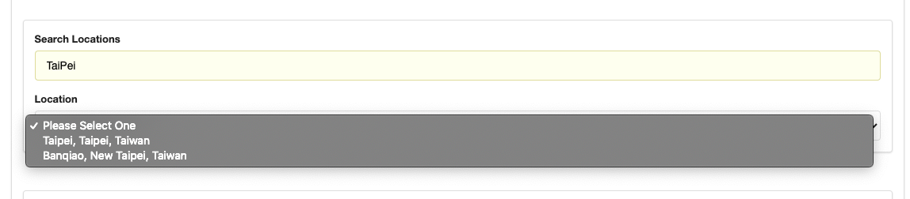

Add More Photos To Your Account And Change Your Profile Pic:


Use the navigation up top to:

See Your Notifications

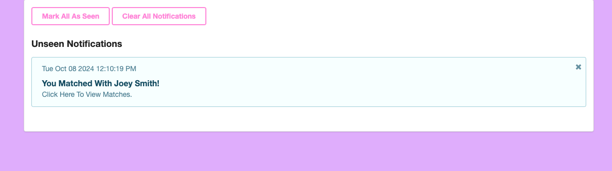

See Your Matches

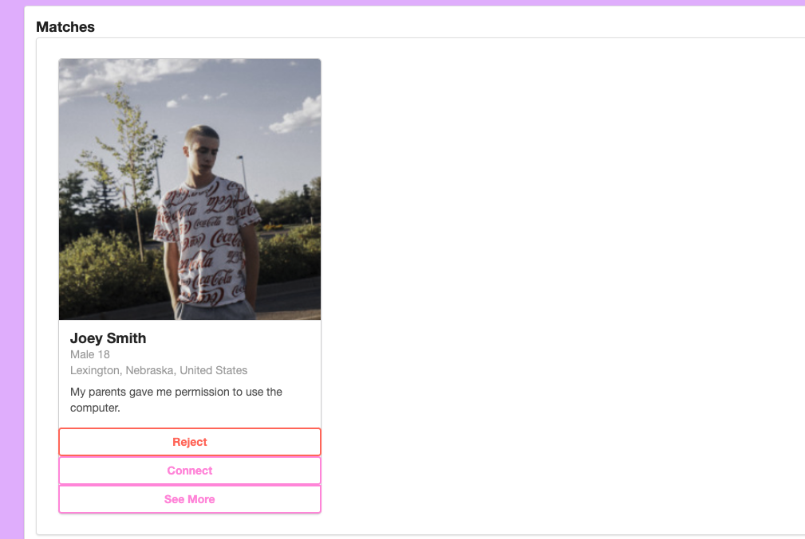

See Your Chats

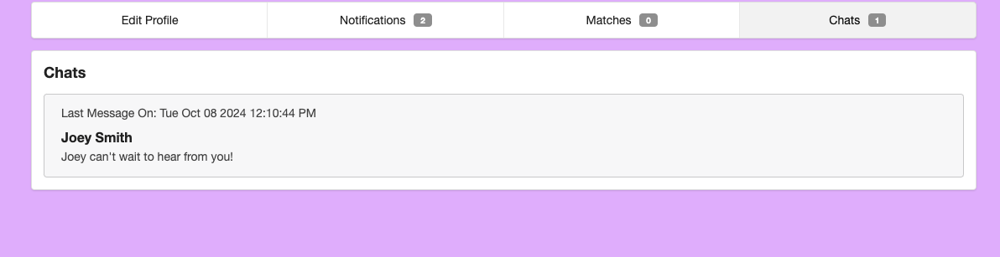

In here you can click a chat to open the chatroom:

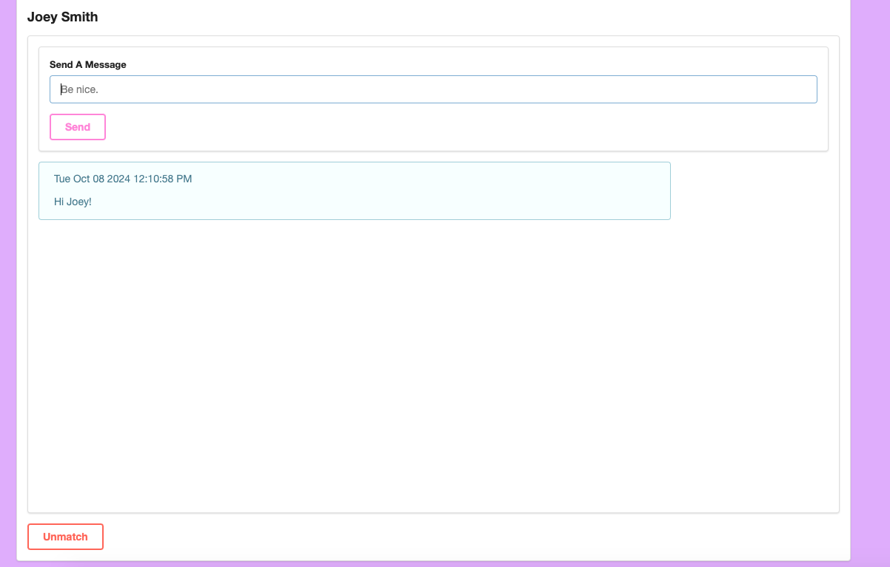

In a chatroom socket io is used to provide live feedback.

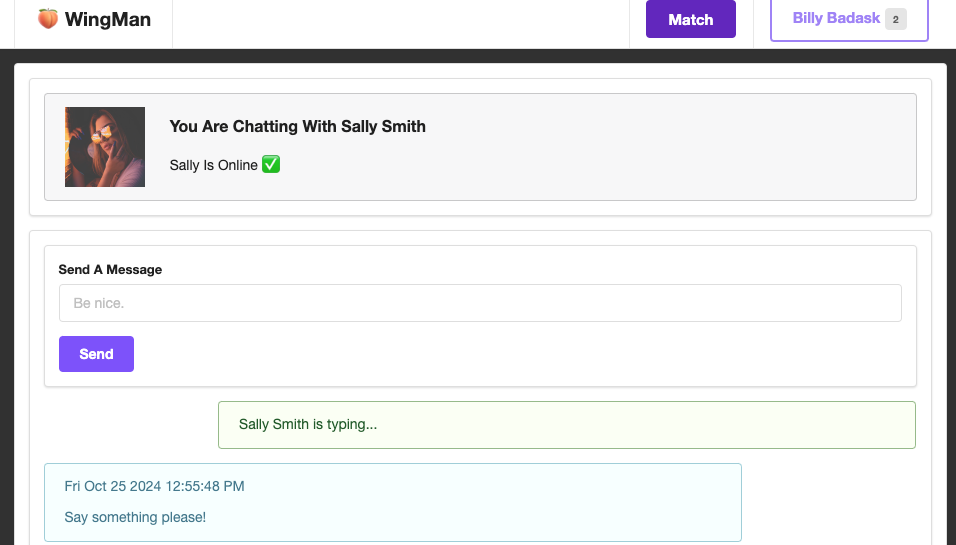

And at any point you can view the matching page by the link in the navbar:

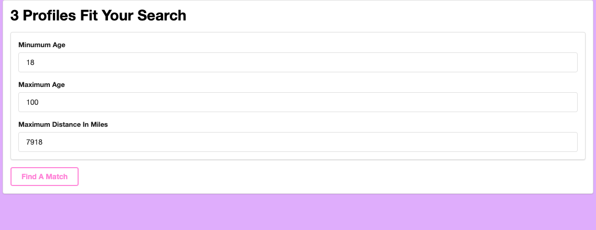

This is where you put in your search terms and find matches.

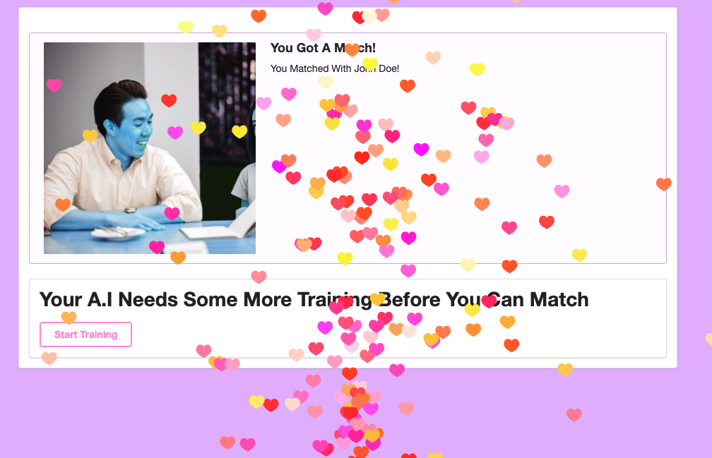

Odds are that you will need to train your model before matching.

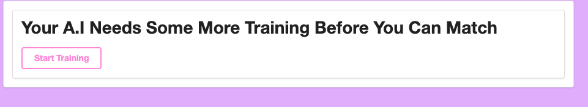

Do this on the training page, where you are prompted to rate images, at least 20.

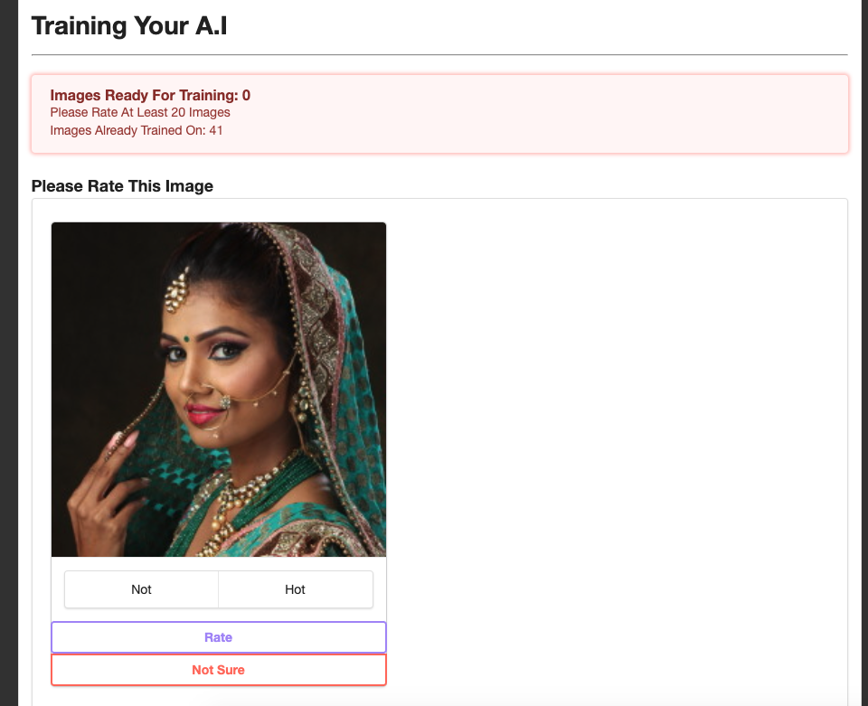

Once you have classified enough images you will be prompted to execute training, go ahead.

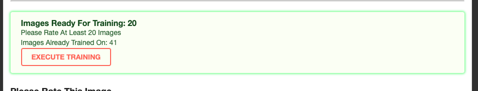

You will be taken to the execution page, sit back and let the A.I learn.

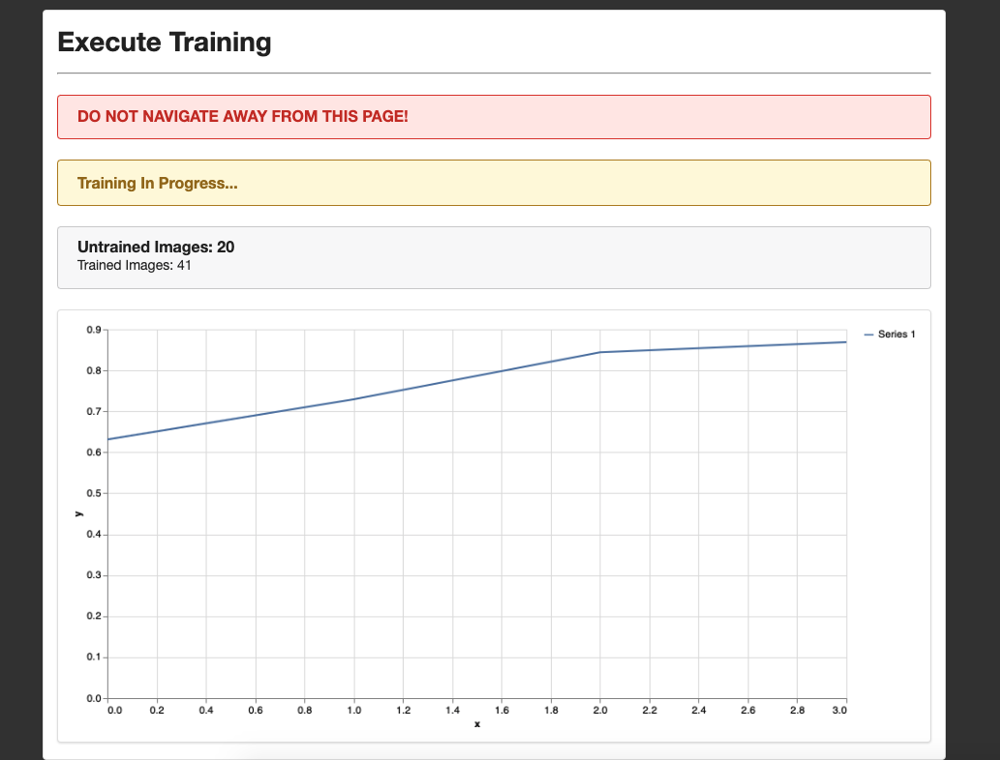

Once it is done you will be sent to the AI Statistics page, where you can see the changes.

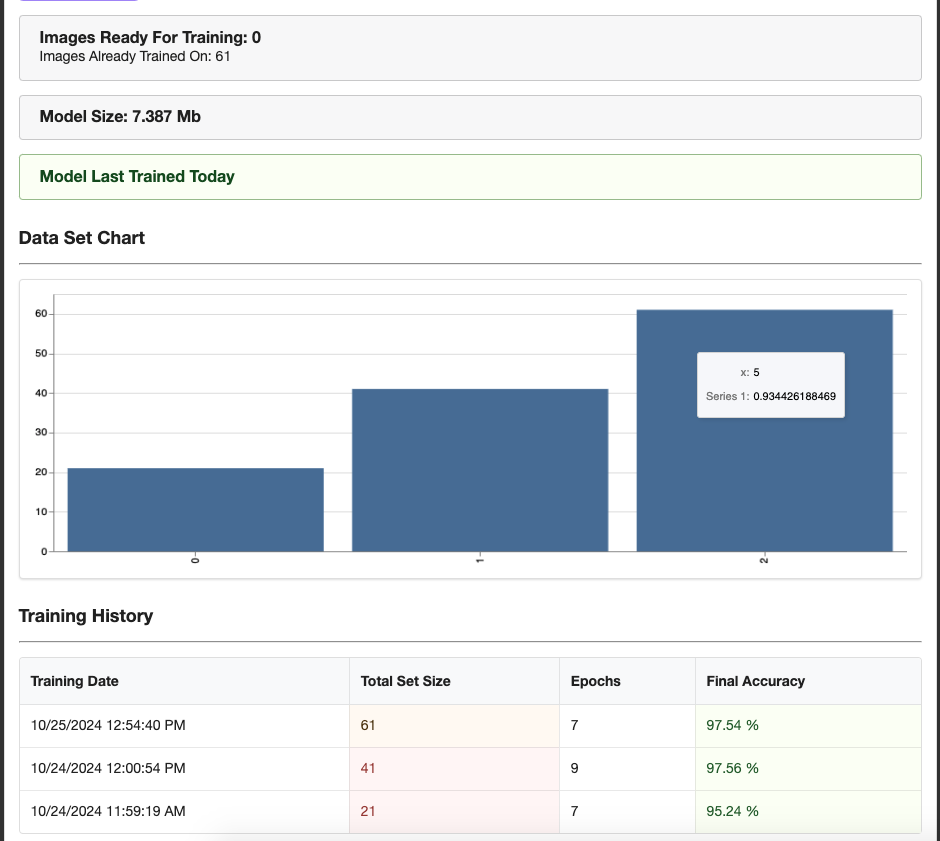

Now you are ready to make another match!

That's it!

**Hope You Enjoy!**

---

## Testing

Testing has been removed from this project due to time and resource limitations.

---

## Contact

If you have any questions and or suggestions regarding this project please contact The Last Mile. They will relay messages to the developer/me.

---

## Project Status

TEMPORARILY STALLED

Need access to tfjs-node in order to train the machine learning models to really perform as desired.

---

## Author

**Falken Brown**

October 2024

The Last Mile

Montana State Prison

---

## Fake Profiles

**ALL OF THE PASSWORDS ARE "password"**

1. Sally Smith EMAIL: sally.smith@hotmail.com
2. Billy Badask EMAIL: billy.badask@gmail.com
3. John Doe EMAIL: john.doe@fake.com
4. Julie Ceaser EMAIL: julie.ceaser@aol.com
5. Jane Duh EMAIL: jane.duh@gmail.com
6. Livi Travels EMAIL: livi.travels@gmail.com
7. Laura Croft EMAIL: laura.croft@gmail.com

---

## To Do List

PERFORMANCE

* REDUCE PAGE RELOADS AND API CALLS
* MESSAGES ARE PASSED VIA SOCKETS WITHOUT RELOADS
* SERVICE WORKERS
  * USE CACHE API TO STORE TFJS AND VISOR ECT.
* MOVE LARGE ASSETS OUT OF REACT PACKAGE TO SERVER SIDE
* SIMPLE SERVER-SIDE PRE-RENDERING

INTEGRATE MEANINGFUL TESTS

* TESTS SHOULD CHECK THE FULL STATE LIFECYCLE OF COMPONENTS
* SIMULATE ERROR STATES
* THIS WAY BREAKING CHANGES CAN BE ISOLATED
* TESTS SHOULD BE UNIT/COMPONENT SPECIFIC
* CREATE TESTS TO TEST ML MODEL PREDICTIONS
* COMPLETE SERVER TESTING OF ROUTES
* CLIENT SIDE TESTING

MORE FEATURES

* OPTION TO FLAG PROFILES AS SPAM -- BLOCK FLAGGED ACCOUNTS
* SPAM PROFILE DETECTION MODEL
* OVERARCHING MODEL FOR LEARNING USER BEHAVIOR BASED ON PAST MODEL RESULTS
* ADD RETRAINED FACE DETECTOR TO ISOLATE FACES FOR BETTER PREDICTIONS WHEN FED TO OTHER MODEL
* AI ANIMATIONS
  * NEON GLOW MOVES ACROSS SCREEN PERIMETER
  * RADIAL GRADIENT PULSE WHEN AI MAKES A PREDICTION
  * AI GLOWS AROUND SPECIFIC IMAGE AREA LIKE A PERSONS OUTLINE
  * NEURAL NET BRAIN ANIMATION FOR THINKING WAIT TIMES WITH BLUE GLOWS
  * PROFILE CARDS ARE SHOWN, ANALYZED, SORTED, DROPPED, AND REPEATED VISUALLY WHEN AI IS SCANNING PROFILES
  * COOL BLUE MIND ANIMATION
  * SCANNING SQUARE ON IMAGES
  * VISIBLE CONVOLUTIONS
  * PACHINKO ANIMATION OF NEURAL NET
  * IMAGE OF OLD COMPUTER WITH SAD FACE BEFORE TRAINING
  * IMAGE OF NEW HIGH TECH COMPUTER WITH THUG LIFE SUNGLASSES ON AFTER TRAINING
  * TWINKLE ANIMATION ON NEW COMPUTER

BUGS

* MYSTERY GPU MEMORY LEAK IN MatchWorker.js
  * MAY BE CAUSED BY DROPOUT/DENSE LAYERS
  * SEEMS BENIGN FOR NOW
  * LIKELY AN ISSUE WITH THE TENSORFLOW API ITSELF
  * POSSIBLE BUG REPORT: https://github.com/tensorflow/tensorflow/issues/11273
* FORMIDABLE ISSUE WHEN UPSERTING MODEL
  * SERVER CRASH IF REQUEST IS CANCELLED MID-TRANSFER
  * NEED TO VIEW FORMIDABLE API DOCUMENTATION TO ISOLATE THE ISSUE
  * EDGE CASE BUT SINCE CLUSTERING IS CURRENTLY DISABLED IT COULD KILL THE SERVER